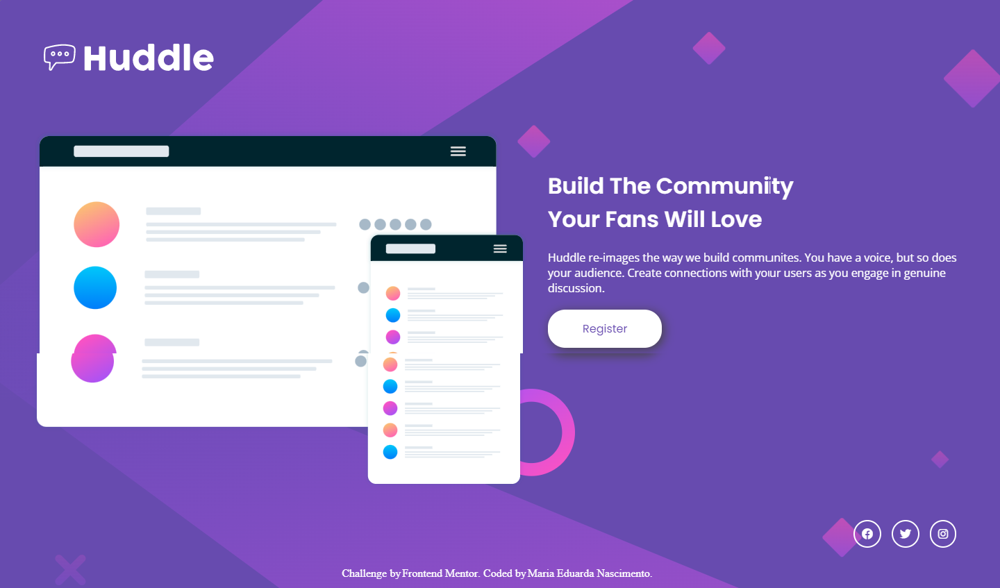
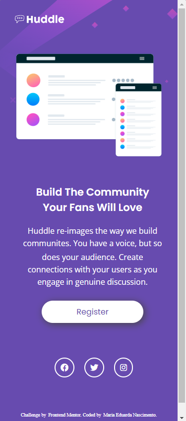

# HUDDLE LANDING PAGE

Pagina criada como solução de um desafio do site Front-End mentor [Huddle landing page with single introductory section challenge on Frontend Mentor](https://www.frontendmentor.io/challenges/huddle-landing-page-with-a-single-introductory-section-B_2Wvxgi0).

## Indice

- [Sobre o Desafio](#sobre-o-desafio)
- [Visão Geral](#visão-geral)
- [Meu processo](#meu-processo)
    - [Linguaguens Utilizadas](#linguaguens-utilizadas)
    - [O que aprendi](#o-que-eu-aprendi)
- [Contato](#contato)
- [Agredecimento]()
 

## Sobre o Desafio

Os usuários devem ser capazes de:

- Visualize o layout ideal para a página, dependendo do tamanho da tela do dispositivo
- Veja os estados de foco para todos os elementos interativos na página

## Visão Geral

Visão geral da tela do desktop

 
Visão geral da tela do desktop

## Meu Processo 

Ao construir essa landing page, meu primeiro passo foi todo o html. Com ele pronto, passei para o css onde comecei a estilização por partes. 
Durante minha jornada de estudos, aprendi a "repartir" o projeto e assim construi-lo por partes. Desse modo não me perco no codigo, ele não fica bagunçado e consigo me deidicar exclusivamente a cada seção.
Foi relativamente mais facil fazer essa landing page com esse processo.

### Linguaguens Utilizadas

- HTML
- CSS

### O que eu aprendi

Para esse desafio pude colocar em pratica o conhecimento adquirido durante meus estudos, como as propriedades flex-box, as pseudo-classes, icons (a apartir de fonts web).

Uma das coisas que aprendi ao realizar essa landing page foi a propriedade box shadow, que ainda não havia usado em nenhum projeto antes. 

## Contato

- LinkedIn - [Maria Eduarda Nascimento](https://www.linkedin.com/in/mariaeduarda-nascimento/)

## Agradecimentos

Meu eterno obrigada a Ricardo e Roberto Dias e toda equipe DevQuest pela dedicação em proporcionar um curso de qualidade e ensinando o que sabem para quem tem, assim como eu, o sonho de programar.
